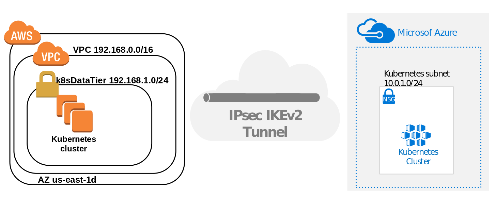

# Cross Cloud VPN: Site-to-Site IKEv2 based on OpenBSD

This is a guide on how to securely connect two public clouds,AWS and Azure. The solution entails the use of an IPSec IKEv2 VPN running on OpenBSD.  

# Design Overview

## Audience

The target audience for this tutorial is someone planning to support a production Kubernetes cluster and wants to understand how everything fits together.

## Solution Details

This guide will walk you through the process of connecting VMs running on AWS and Azure. For this exercise, the following considerations were taken:

* OpenBSD 6.1 amd64
* Azure CLI 2.0
* Different VNets and VPC CIDR networks. They must be different and non overlapping. See the [Before You Begin](sections/01-before-you-begin.md) for details on network planning.
   
## Sections

- [Before You Begin](sections/01-before-you-begin.md)
- [Design Overview](sections/design.md)
- [Configuring Azure](sections/02-configuring-azure.md)
- [Configuring AWS](sections/03-configuring-aws.md)
- [Testing](sections/04-plumbing.md)
- [Troubleshooting](sections/05-troubleshooting.md)
- [What's next ?](sections/06-next.md)