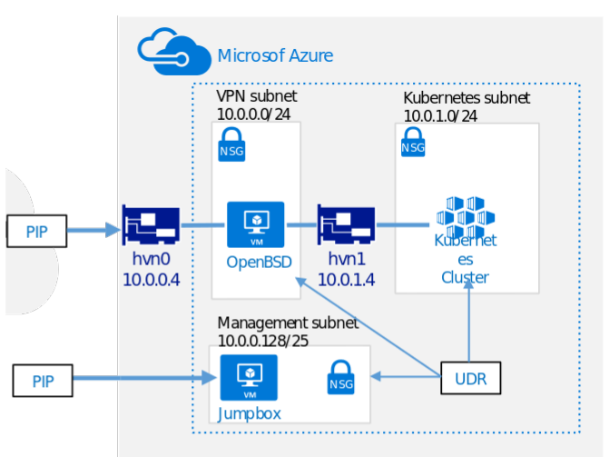

# Configuring Azure


In this section, we will create an OpenBSD VM with two NICs as well as the underlying infrastructure needed to support this scenario (e.g.: VNet, subnets, routes and others) The following diagram illustrates this architecture:




## Route Table

To send traffic from our Azure VNet back to the AWS VPC, we will setup the following route:

|Destination | Target | Notes   
|---|---|---
|172.31.0.0/16 | 10.0.1.4 | OpenBSD's private NIC IP address

## Step-by-step overview

1. Create a Resource Group
1. Create a VNet with a large network (e.g.: 10.0.0.0/16)
1. Carve 3 subnets (k8sDataTier, Management, VPN)
1. Create the OpenBSD VM with two NICs (via Azure CLI)
    1. For each NIC enable IP forwarding
1. Add the route to Azure (e.g.: 192.168.0.0/16) on the UDR
1. Allow traffic on the Security Groups (ports 500, 4500 UDP)
1. Attach a Public IP to the OpenBSD interface on the VPN subnet.
1. Configure OpenIKED.

## Detailed instructions

### Create a Resource Group

> NOTE: Bear in mind that you can use existing resources by adjusting your commands below. 


```bash
#Define a Resource Group. This parameter will be used along the way.
export AZURE_OPENBSD_RG=myOpenBSD_RG
az group create --name ${AZURE_OPENBSD_RG} --location westus2
```

### Create the VNet and the first subnet (VPN)

```bash 
az network vnet create \
    --resource-group ${AZURE_OPENBSD_RG} \
    --name ${AZURE_OPENBSD_RG}-VNet \
    --address-prefix 10.0.0.0/16 \
    --subnet-name ${AZURE_OPENBSD_RG}-VPN-subnet \
    --subnet-prefix 10.0.0.128/25
```

### Create the second VNet
```bash 
az network vnet subnet create \
    --resource-group ${AZURE_OPENBSD_RG} \
    --vnet-name ${AZURE_OPENBSD_RG}-VNet \
    --name ${AZURE_OPENBSD_RG}-private-subnet \
    --address-prefix 10.0.1.0/24
```

### Create the Network Security Groups (NSG)

Create the VPN NSG 
```bash 
az network nsg create \
    --resource-group ${AZURE_OPENBSD_RG} \
    --name ${AZURE_OPENBSD_RG}-VpnNSG
```

Create the private NSG
```bash
az network nsg create \
    --resource-group ${AZURE_OPENBSD_RG} \
    --name ${AZURE_OPENBSD_RG}-privateNSG
```

### Add a rule to allow SSH to the VPN NSG

```bash
az network nsg rule create \
    --name allow-ssh \
    --nsg-name ${AZURE_OPENBSD_RG}-VpnNSG \
    --resource-group ${AZURE_OPENBSD_RG} \
    --priority 100 \
    --protocol Tcp \
    --destination-port-ranges 22
```

### Create two NICs

Create the first NIC for the VPN subnet:

```bash
az network nic create \
    --resource-group ${AZURE_OPENBSD_RG} \
    --name VpnNIC \
    --vnet-name ${AZURE_OPENBSD_RG}-VNet \
    --subnet ${AZURE_OPENBSD_RG}-VPN-subnet \
    --network-security-group ${AZURE_OPENBSD_RG}-VpnNSG \
    --ip-forwarding
```

Create the second NIC for the private subnet:

```bash
az network nic create \
    --resource-group ${AZURE_OPENBSD_RG} \
    --name privateNIC \
    --vnet-name ${AZURE_OPENBSD_RG}-VNet \
    --subnet ${AZURE_OPENBSD_RG}-private-subnet \
    --network-security-group ${AZURE_OPENBSD_RG}-privateNSG \
    --ip-forwarding
```

### Create the route table

```bash
az network route-table create \
    --name ${AZURE_OPENBSD_RG}-Route-Table \
    --resource-group ${AZURE_OPENBSD_RG} 
```

## Add entries to the route table

```bash
az network route-table route create \
    --name To-AWS \
    --address-prefix 172.31.0.0/16 \
    --next-hop-type VirtualAppliance \
    --next-hop-ip-address 10.0.1.4 \
    --resource-group ${AZURE_OPENBSD_RG}  \
    --route-table-name ${AZURE_OPENBSD_RG}-Route-Table
```

To confirm the entries

```bash 
az network route-table show -n ${AZURE_OPENBSD_RG}-Route-Table -g ${AZURE_OPENBSD_RG}
```

Next: [Configuring AWS](03-configuring-aws.md)