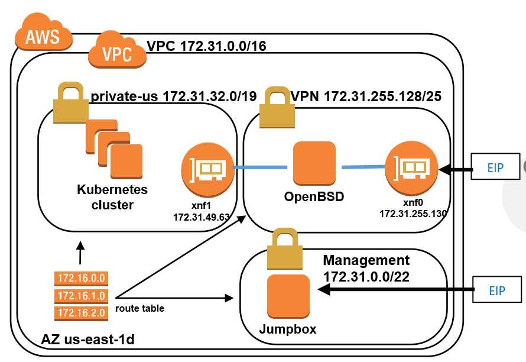
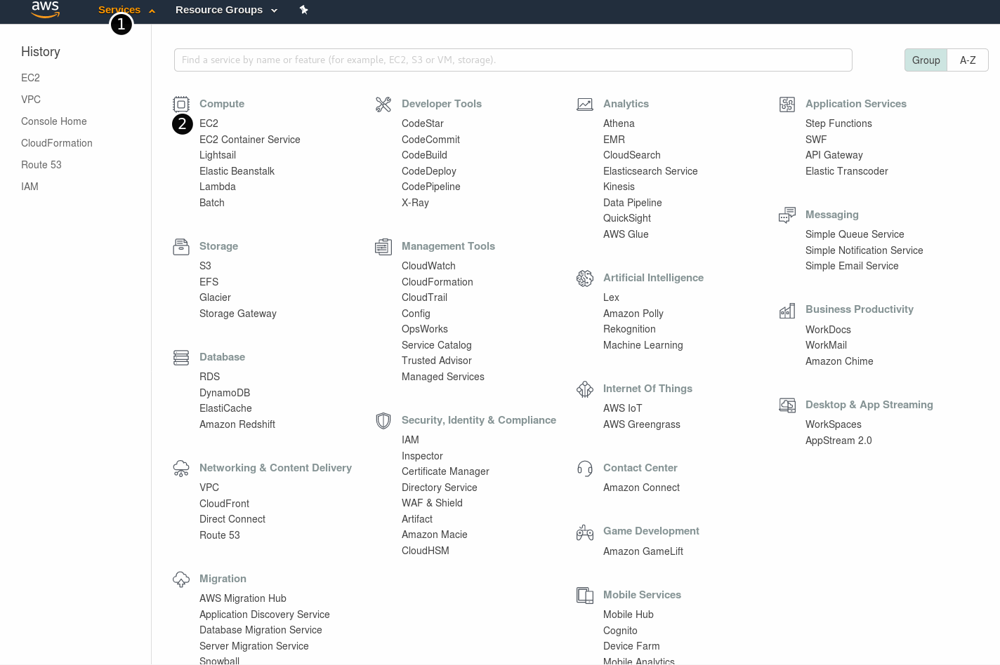
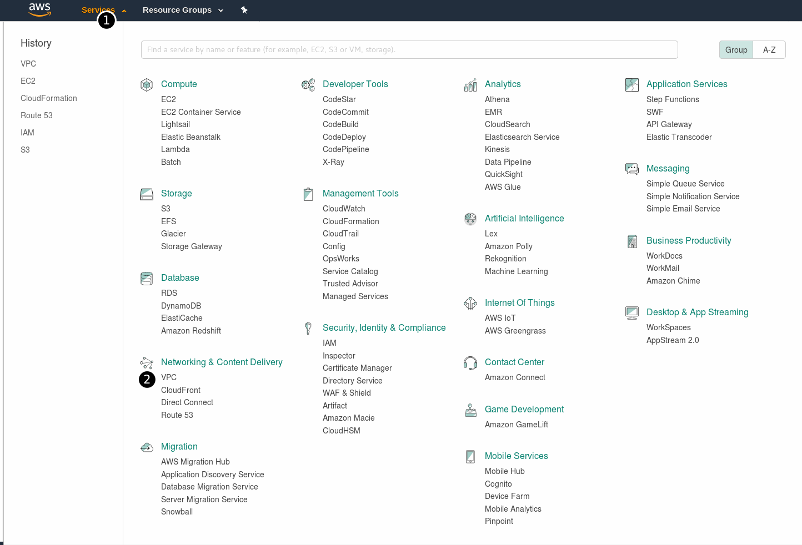
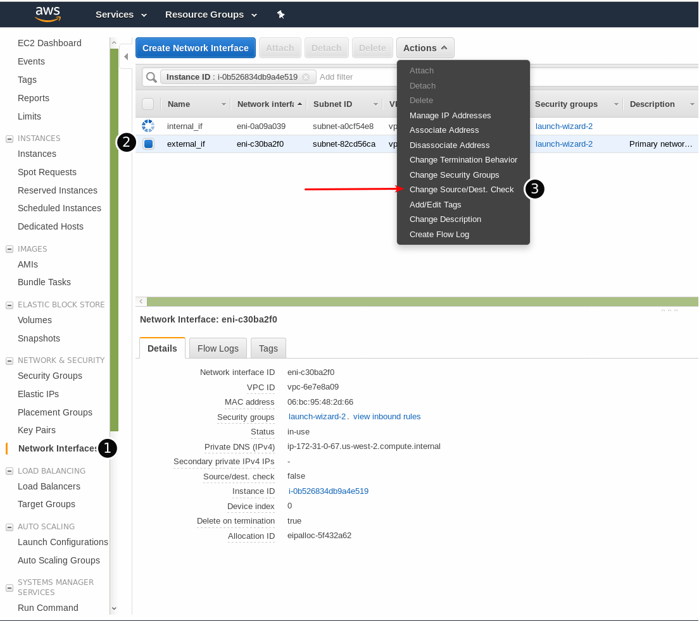
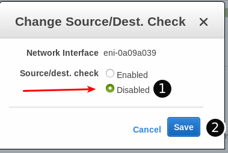
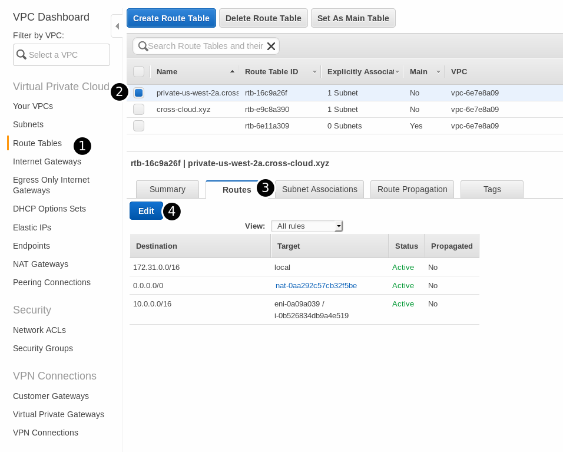
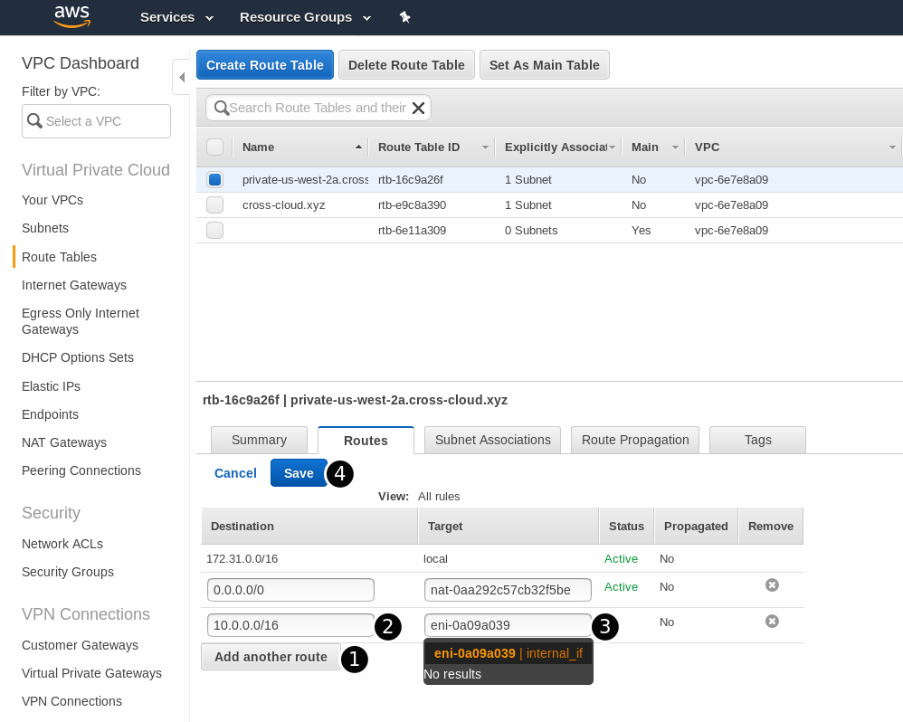
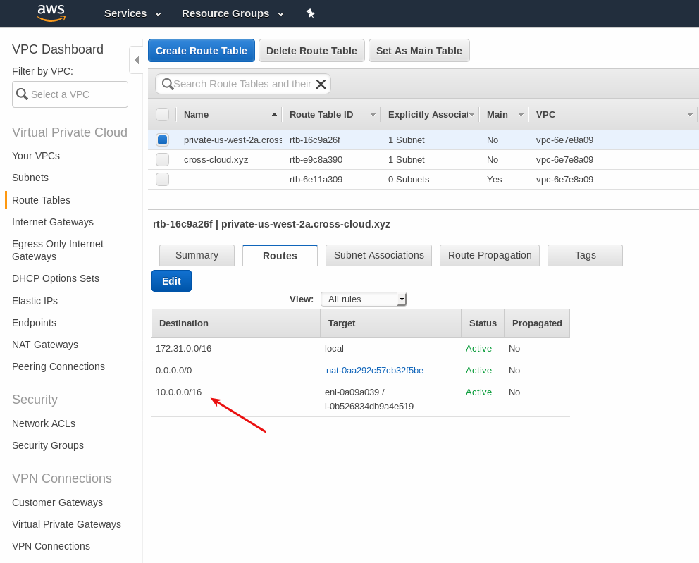

# Configuring AWS

## Step-by-step overview

1. [Create a VPC with a large network (e.g.: 172.31.0.0/16)](#create-the-vpc). This will allow us room for trying other experiments in the future.
1. Carve 2 subnets (e.g.: Private and VPN). Our VM will have a NIC in each one of these subnets.
1. [Create the OpenBSD VM with two NICs](#create-the-openbsd-vm)
    1. For each NIC **disable source/dest check** [allowing packet forwarding](#allow-packet-forwarding)
1. [Add the route to Azure (e.g.: 10.0.0.0/16)](#route-table-overview)
1. [Allow traffic on the Security Groups (ports 500, 4500 UDP)](#allow-traffic)
    1. For troubleshooting, also allow ICMP and SSH between the two networks.
1. [Attach an Elastic IP to the OpenBSD interface on the VPN subnet.](#attach-eip)
1. [Configure OpenIKED.](04-setting-openbsd.md)

References: 
* [Example: Create an IPv4 VPC and Subnets Using the AWS CLI 
](http://docs.aws.amazon.com/AmazonVPC/latest/UserGuide/vpc-subnets-commands-example.html)

## Create the VPC

#### Go to the VPC

1. Click on the **Services** drop-down menu.
1. and select **VPC** under the *Networking & Content Delivery* section

## Carve the subnets

## Create the OpenBSD VM

## Allow packet forwarding

### Go to EC2

1. Click on the **Services** drop-down menu.
1. and select **EC2** under the *Compute* section

### Disable source/destination check

1. Click on the **Network Interfaces** 
1. Select a network interface (e.g.: the external_if interface). Note that you _must_ do this for both interfaces.
1. Click on **Change Source/Dest. Check** under the **Actions** button. 

When the _Change Source/Dest. Check_ window appears:

1. Select **Disabled** 
1. Click save.

Repeat this process for all interfaces that need to pass traffic.

## Allow Traffic

## Attach EIP

## Route Table Overview

|Destination | Target | Notes   
|---|---|---
|172.31.0.0/16 | local | VPC CIDR
|0.0.0.0/0 |  Internet Gateway |    
|10.0.0.0/0 | xfn1 / OpenBSD | Route to Azure's VNET pointing to OpenBSD's internal NIC interface

### Add a route to Azure's VNet

#### Next, create the route table entry.

1. Under the Virtual Private Cloud, select **Route Tables**
1. Select the subnet which you want to add the route. In our example, we will select the `private-us-west-2a` one.
1. Click ont he **Routes** tab 
1. and then click on **Edit**

Once inside of the route table

1. Click on **Add another route**
1. Under the _Destination_ field, write Azure's VNet CIDR. In our exercise _10.0.0.0/16_.
1. Select OpenBSDs internal interface. You can either search for the name of the interface (e.g.: eni-XXXX) or search for a tag (e.g.: internal_if)
1. Click on **Save** 

Your route table should look like resemble this one:

Next: [Setting up OpenBSD](04-setting-openbsd.md)
