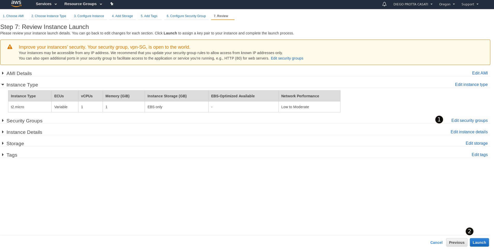

# Configuring AWS

## Step-by-step overview

1. [Create a VPC with a large network (e.g.: 172.31.0.0/16)](#create-the-vpc). This will allow us room for trying other experiments in the future.
1. Carve 2 subnets (e.g.: Private and VPN). Our VM will have a NIC in each one of these subnets.
1. [Create the OpenBSD VM with two NICs](#create-the-openbsd-vm)
    1. For each NIC **disable source/dest check** [allowing packet forwarding](#allow-packet-forwarding)
1. [Add the route to Azure (e.g.: 10.0.0.0/16)](#route-table-overview)
1. [Allow traffic on the Security Groups (ports 500, 4500 UDP)](#allow-traffic)
    1. For troubleshooting, also allow ICMP and SSH between the two networks.
1. [Attach an Elastic IP to the OpenBSD interface on the VPN subnet.](#attach-eip)
1. [Configure OpenIKED.](04-setting-openbsd.md)

References: 
* [Example: Create an IPv4 VPC and Subnets Using the AWS CLI 
](http://docs.aws.amazon.com/AmazonVPC/latest/UserGuide/vpc-subnets-commands-example.html)

## Create the VPC

#### Go to the VPC section

1. Click on the **Services** drop-down menu.
1. and select **VPC** under the *Networking & Content Delivery* section

1. Choose a name for your VPC
1. Select a CIDR block. In our example: 172.31.0.0/16
1. Click on **Yes, Create**

## Carve the subnets

1. Click on **Subnets** under the **Virtual Private Cloud** section on the left-side navigation bar.
1. Click on the **Create Subnets** button

In this windows you can select all of the details of the subnets such as the:

1. name of the subnet
1. VPC to create the subnet
1. Availability Zone and
1. the CIDR 

Repeat this process for the subnets for the following subnets and CIDRs.

| Name | CIDR | Nb of Hosts
|- | - | -
| VPN | 172.31.255.128/25 | 126
| Private | 172.31.0.0/19 | 8190

## Create the OpenBSD instance

If you've executed the steps described on the [Before You Begin](01-before-you-begin.md) section you should now have an OpenBSD AMI ready for consumption. Let's proceed by creating the instance.

### Go to EC2

1. Click on the **Services** drop-down menu.
1. and select **EC2** under the *Compute* section

1. Click on the **EC2 Dashboard**
1. Click on **Launch Instance**

> NOTE: Note that we are creating our resources in the **Oregon** region. If you are using a different region, please change that here.

1. Click on **My AMIs**
1. Select your OpenBSD image

From here, follow the rest of the configuration guide and choose an instance type (for testing purposes, I've used a _t2.micro_ instance.)

1. Select your instance size
1. Click on **Next: Configure Instance Details**

1. Select your VPC
1. Select the subnet for the first (main) interface
1. Add a new interface and select the subnet that it will be attached to. 
1. Click on **Review and Launch**

> NOTE: If you are deploying this in production, I'd recommend you check the **Enable termination protection** option (the red arrow is pointing to that option). This is an extra safe mechanism that will prevent the accidental termination of your instance.

The last modification is to add rules to the Security Groups. 

1. Click on **Edit security groups**

[AWS Security Group Add Rules](images/aws-sg-add-rules.png)
1. To add a new rule, click on **Add Rule**.

We need to create the following rules:

| Type | Protocol | Port Range | Source | Description
| - | - | - | - | -
| SSH | TCP | 22 | Custom: 0.0.0.0/0 |  Note that you can lock this to your public IP if you wanted. We will lock this down with PF as well.
| All ICMP - IPv4 | ICMP | 0-65535 | Custom: Azure CIDR | From Azure
| Custom UDP | UDP | 500 | Custom: Azure CIDR | From Azure - IPsec
| Custom UDP | UDP | 4500 | Custom: Azure CIDR | From Azure - IPsec

When you are done with the rules here, go ahead and click on **Review and Launch** and finally, under the **7.Review** section click on **Launch**.

The last step is to select a key pair or to create one if needed. If you already have a key, here's what you need to do:

1. Click on **Choose an existing key pair**
1. Select a key pair and acknowledge that you have the private key.
1. Click on **Launch Instances**

After the instance is ready, return to the **Instances** section and put a meaningful name to the instance. This will help you to easily identify this instance later.

1. Click on **Instances**
1. Click on the pen icon to edit the name of the instance.

We will also add a name to our network interfaces. 

1. Click on the **Network Interfaes** under _NETWORK & SECURITY_
1. Name the _Primary network interface_ as **ext_if** 
1. Name the second interface as **int_if**. 

## Allow packet forwarding

### Go to EC2

1. Click on the **Services** drop-down menu.
1. and select **EC2** under the *Compute* section

### Disable source/destination check

1. Click on the **Network Interfaces** 
1. Select a network interface (e.g.: the external_if interface). Note that you _must_ do this for both interfaces.
1. Click on **Change Source/Dest. Check** under the **Actions** button. 

When the _Change Source/Dest. Check_ window appears:

1. Select **Disabled** 
1. Click save.

Repeat this process for all interfaces that need to pass traffic.

## Allow Traffic

## Attach EIP

1. Click on the **Elastic IPs** under _NETWORK & SECURITY_
1. Click on **Allocate new address**

1. Next, click on **Allocate**

Back to the main Elastic IPs screen, right click on your newly allocated address and choose **Associate address**

XXX

## Route Table Overview

|Destination | Target | Notes   
|---|---|---
|172.31.0.0/16 | local | VPC CIDR
|0.0.0.0/0 |  Internet Gateway |    
|10.0.0.0/0 | xfn1 / OpenBSD | Route to Azure's VNET pointing to OpenBSD's internal NIC interface

### Add a route to Azure's VNet

#### Next, create the route table entry.

1. Under the Virtual Private Cloud, select **Route Tables**
1. Select the subnet which you want to add the route. In our example, we will select the `private-us-west-2a` one.
1. Click ont he **Routes** tab 
1. and then click on **Edit**

Once inside of the route table

1. Click on **Add another route**
1. Under the _Destination_ field, write Azure's VNet CIDR. In our exercise _10.0.0.0/16_.
1. Select OpenBSDs internal interface. You can either search for the name of the interface (e.g.: eni-XXXX) or search for a tag (e.g.: internal_if)
1. Click on **Save** 

Your route table should look like resemble this one:

Next: [Setting up OpenBSD](04-setting-openbsd.md)
