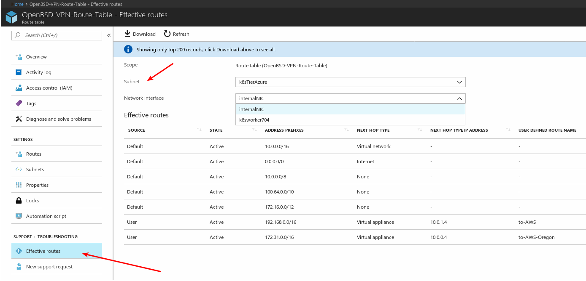

# Troubleshooting

One of the most common issues is that you don't have traffic between the two clouds and due to the complex nature or the setup, it is easy to overlook a section or parameter. Here's a list of the things that you must check in order to have traffic. They are separated here by their logical category (e.g.: Security Groups will be Chances are that your issue will be related to one of them.

### AWS Specifics:

VPC
- Did you add the route to Azure in the VPC route table?
- Is your Security Group allowing traffic on:
    - For IPsec: UDP 500, UDP 4500
    - For others: TCP 22 (ssh), ICMP
- Do you have any rules in your VPC ACLs could be blocking traffic ?

EC2
- Check that the **source/dest check** for both network cards in the OpenBSD EC2 instance are _disabled_

### Azure Specifics:

Resource Group
- Check if ***IP Forwarding*** is enabled for both network interfaces on your OpenBSD instance.

- Check that your route table has a route pointing *back* to AWS. 
- Check that the Network Security Groups used are not blocking traffic to and from AWS.

To have a look at how the route table is configure, in the portal, navigate to the Route table and then scroll down to the **SUPPORT + TROUBLESHOOTING** and to the **Effective routes** section. 

Here you can filter per interface and subnet and have a quick view of how the network routing table is setup.

### OpenBSD Specifics:

OpenBSD - applicable to both, AWS and Azure
- Make sure that you have **net.inet.ip.forwarding=1**.
- Check your iked.conf (/etc/iked.conf) file and make sure the information is correct.
- Can you see any security associations and flows? Try `ipsecctl -sa`
- Do you have any rule on `pf.conf` blocking your traffic ? Check the rules with `pfctl -sr`

Next: [What's Next ?](06-next.md)